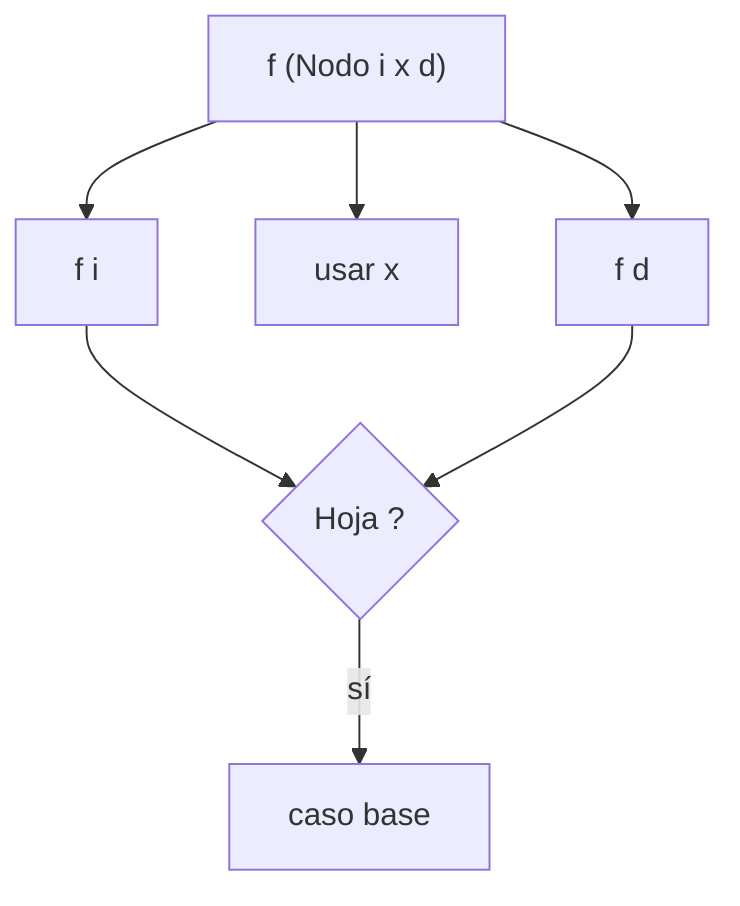

# Construcción de funciones recursivas sobre árboles binarios

## Objetivo

Entra un `Arb a`; sale una función recursiva con **dos** llamadas por caso recursivo, una por
subárbol.

"Dado el siguiente data que represente árboles binarios con información
de tipo a en los nodos externos e internos, como lo veíamos en fundamentos:
`data Arb a where {Hoja :: a -> Arb a; Nodo :: Arb a -> a -> Arb a -> Arb a}`"

"Ahora veremos el data de la siguiente forma:
`data Arb a = Hoja a | Nodo (Arb a) a (Arb a)`"

Clave para no equivocarse: **hay información de tipo `a` en las hojas y también en los
nodos internos**. `Hoja` lleva un `a`; `Nodo` lleva un `a` entre sus dos subárboles.

## Procedimiento

1. Dos constructores → dos casos: `Hoja x` y `Nodo i x d`.
2. Caso `Hoja x`: decidí si el valor `x` de la hoja **cuenta o no** para lo que estás
 calculando. Es la decisión que separa `cantNodos` de `cantHojas` de `cantA`.
3. Caso `Nodo i x d`: combiná el `x` del nodo con **las dos** llamadas recursivas,
 `f i` y `f d`. Olvidarse de una es el error típico.
4. Forma λ: `f = λa -> case a of { Hoja x -> ...; Nodo i x d -> ...}`.
5. Forma pattern-matching: `f (Hoja x) = ...` y `f (Nodo i x d) = ...`, con paréntesis.
6. Si el resultado es una lista, el orden en que concatenás (`f i ++ [x] ++ f d`) define el
 recorrido. El repartido no dice cuál quiere para `listA`.

## Diagrama



## Caso resuelto

La cátedra resuelve `cantNodos` en las dos formas:

```haskell
cantNodos :: Arb a -> Integer
cantNodos = λa -> case a of {
 Hoja x -> 0; Nodo i x d -> 1+(cantNodos i)+(cantNodos d) }

cantNodos :: Arb a -> Integer
cantNodos (Hoja x) = 0
cantNodos (Nodo i x d) = 1+(cantNodos i)+(cantNodos d)
```

`cantNodos` cuenta **solo los nodos internos**: la hoja aporta `0`. `cantHojas` es la misma
función con los papeles cambiados (`Hoja x -> 1`, y el nodo aporta `0`):

```haskell
cantHojas :: Arb a -> Integer
cantHojas (Hoja x) = 1
cantHojas (Nodo i x d) = (cantHojas i)+(cantHojas d)
```

Resolución **inferida**, no oficial.

## Consignas pendientes

Firmas textuales del repartido:

| Ej. | Firma | Estado |
|---|---|---|
| (b) | `cantHojas :: Arb a -> Integer` | resuelta arriba |
| (c) | `cantA :: Arb a -> Integer` | pendiente |
| (d) | `listA :: Arb a -> [a]` | pendiente, ver abajo |
| (e) | `mapF :: (a -> b) -> Arb a -> Arb b` | pendiente |

`cantA` cuenta los valores de tipo `a`, que están en hojas **y** en nodos: debería dar
`cantNodos + cantHojas`. Usalo como chequeo de tu respuesta.

El repartido **no especifica el orden de recorrido de `listA`** (in-order, pre-order,
post-order) ni da un ejemplo. Las tres respuestas son defendibles. Preguntalo en clase o en la
defensa. Anotado en `wiki/dudas.md`.

`mapF` es la única que devuelve un `Arb`: aplica `f` a los valores y **preserva la
estructura**, igual que `map` sobre listas.

## Relacionado

- [[comparativas/lambda-case-vs-pattern-matching]] — las dos formas, lado a lado
- [[construcciones/funciones-sobre-listas]] — el mismo esqueleto con una sola llamada recursiva
- [[fuentes/repaso-haskell]]

## Procedencia

- **Objetivo** — repaso-haskell p.2 · incluye comentario del sistema
- **Procedimiento** — sin cita: comentario del sistema
- **Caso resuelto** — repaso-haskell p.2-3 · incluye comentario del sistema
- **Consignas pendientes** — repaso-haskell p.3 · incluye comentario del sistema · duda registrada en `dudas.md`
