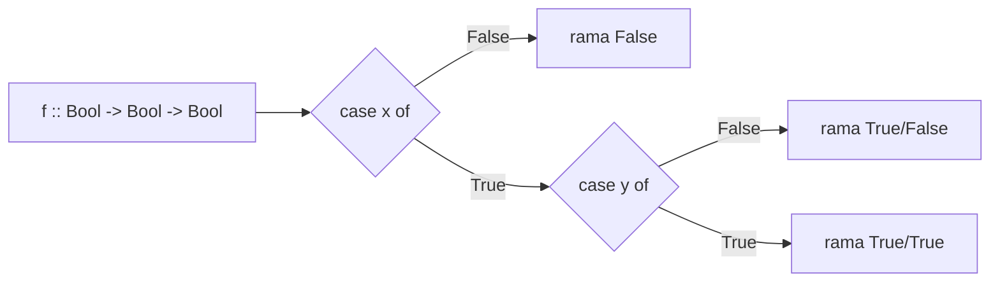

# Construcción de funciones sobre `Bool`

## Objetivo

Entra un `data` con dos constructores sin argumentos; sale una función definida por análisis
de casos, en las dos formas que pide la cátedra.

"Recordemos el data de los booleanos visto en fundamentos:
`data Bool where {False :: Bool; True :: Bool}`"

"Ahora veremos el data de la siguiente forma:
`data Bool = False | True`"

Las dos declaran el mismo tipo. La segunda es la que usa la cátedra de acá en adelante.

## Procedimiento

1. Escribí la **firma** primero: `f :: Bool -> Bool -> Bool`. Fija cuántos argumentos hay.
2. Contá los constructores del `data`: `False` y `True`. Son 2.
3. Con **un** argumento → 2 casos. Con **dos** argumentos → hasta 4 combinaciones.
4. Forma λ: `f = λx -> λy -> case x of {False -> ...; True -> ...}`, anidando un `case` por
 argumento que necesites inspeccionar.
5. Forma pattern-matching: una ecuación por combinación de patrones que te importe.
6. Colapsá casos cuando el resultado no dependa del otro argumento: `False && y = False`
 cubre dos filas de la tabla de verdad de una.

## Diagrama



## Caso resuelto

La cátedra resuelve `not` en las dos formas:

```haskell
not :: Bool -> Bool
not = λb -> case b of {True -> False; False -> True}

not :: Bool -> Bool
not True = False
not False = True
```

Aplicando el procedimiento a `(&&)`, que el repartido deja como consigna:

```haskell
(&&) :: Bool -> Bool -> Bool
(&&) = λx -> λy -> case x of {False -> False; True -> y}

(&&) :: Bool -> Bool -> Bool
False && y = False
True && y = y
```

Resolución **inferida**, no oficial: el repartido no trae soluciones.

## Consignas pendientes

Firmas textuales del repartido:

| Ej. | Firma | Estado |
|---|---|---|
| (b) | `(&&) :: Bool -> Bool -> Bool` | resuelta arriba |
| (c) | `(||) :: Bool -> Bool -> Bool` | pendiente |
| (d) | `(>>) :: Bool -> Bool -> Bool` | pendiente, ver abajo |
| (e) | `(==) :: Bool -> Bool -> Bool` | pendiente |

**`(>>)` no está definido en el repartido.** El símbolo está verificado contra la página,
pero la fuente no dice qué operación es. Sobre `Bool -> Bool -> Bool` lo natural es la
implicación, y en Haskell estándar `>>` es otra cosa (secuenciación monádica). No lo resuelvo
hasta confirmarlo en clase. Anotado en `wiki/dudas.md`.

En el PDF, `(||)` aparece tipografiado con barras dobles de matemática (`(‖‖)`). Es el
`(||)` de Haskell.

## Relacionado

- [[comparativas/lambda-case-vs-pattern-matching]] — las dos formas, lado a lado
- [[construcciones/funciones-sobre-enteros]] — el mismo procedimiento con recursión
- [[fuentes/repaso-haskell]]

## Procedencia

- **Objetivo** — repaso-haskell p.1 · incluye comentario del sistema
- **Procedimiento** — sin cita: comentario del sistema
- **Caso resuelto** — repaso-haskell p.1 · incluye comentario del sistema
- **Consignas pendientes** — repaso-haskell p.1 · incluye comentario del sistema · duda registrada en `dudas.md`
