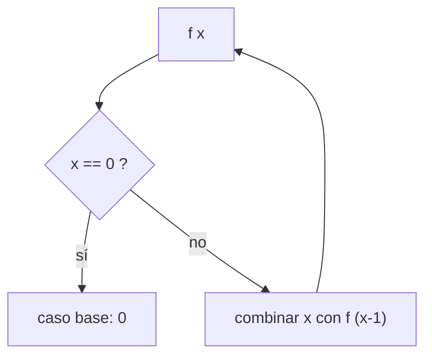

# Construcción de funciones recursivas sobre `Integer`

## Objetivo

Entra un `Integer` (y, en las de orden superior, una o dos funciones); sale una función
recursiva que acumula sobre `0..n`.

Acá aparecen por primera vez las **funciones de orden superior**, que el temario nombra
explícitamente en U10.

## Procedimiento

1. Firma primero. Fijate **cuántos de los argumentos son funciones**: en `sumpfi` son dos.
2. Elegí el **caso base**: `0`. El repartido siempre recursiona bajando de `x` a `x-1`.
3. Escribí el caso recursivo como `<algo con x> + (f (x-1))`.
4. Forma λ: `f = λn -> case n of { 0 -> <base>; x -> <recursivo>}`.
5. Forma pattern-matching: `f 0 = <base>` y `f x = <recursivo>`.
6. Con predicado (`sumpi`), el elemento entra o no según `p x`: necesitás una guarda o un
 `case (p x) of`. Ahí es donde el repartido pide "Pattern-Matching **y guardas**".

## Diagrama



## Caso resuelto

La cátedra resuelve `sumi` en las dos formas:

```haskell
sumi :: Integer -> Integer
sumi = λn -> case n of { 0 -> 0; x -> x+(sumi (x-1))}

sumi :: Integer -> Integer
sumi 0 = 0
sumi x = x+(sumi (x-1))
```

Aplicando el procedimiento a `sumpi`, que el repartido deja como consigna:

```haskell
sumpi :: (Integer -> Bool) -> Integer -> Integer
sumpi p 0 = 0
sumpi p x
 | p x = x + (sumpi p (x-1))
 | otherwise = sumpi p (x-1)
```

Resolución **inferida**, no oficial. Verificala contra el ejemplo de la cátedra antes de
confiar en ella.

## Consignas pendientes

Firmas y ejemplos textuales del repartido:

| Ej. | Firma | Ejemplo de la cátedra |
|---|---|---|
| (b) | `sumpi :: (Integer -> Bool) -> Integer -> Integer` | `sumpi even 8 = 0 + 2 + 4 + 6 + 8 = 20` |
| (c) | `sumfi :: (Integer -> Integer) -> Integer -> Integer` | `sumfi (*2) 3 = 0*2 + 1*2 + 2*2 + 3*2 = 12` |
| (d) | `sumpfi :: (Integer -> Bool) -> (Integer -> Integer) -> Integer -> Integer` | `sumpfi even (*2) 5 = 0*2 + 2*2 + 4*2 = 12` |

Los tres ejemplos empiezan en `0` y suben hasta `n` **inclusive**: `sumpi even 8` incluye el
`8`. El acumulador arranca en el caso base `0`, no en `n`.

Ojo con `sumpfi even (*2) 5`: el resultado es `12` porque el predicado filtra `0,2,4` y
recién ahí se aplica `(*2)`. Primero se filtra, después se transforma.

## Relacionado

- [[comparativas/lambda-case-vs-pattern-matching]] — las dos formas, lado a lado
- [[construcciones/funciones-sobre-bool]] — el mismo procedimiento sin recursión
- [[construcciones/funciones-sobre-listas]] — `map` y `filter`, las mismas dos ideas sobre listas
- [[fuentes/repaso-haskell]]

## Procedencia

- **Objetivo** — sin cita: comentario del sistema
- **Procedimiento** — sin cita: comentario del sistema
- **Caso resuelto** — repaso-haskell p.1 · incluye comentario del sistema
- **Consignas pendientes** — repaso-haskell p.1 · incluye comentario del sistema
