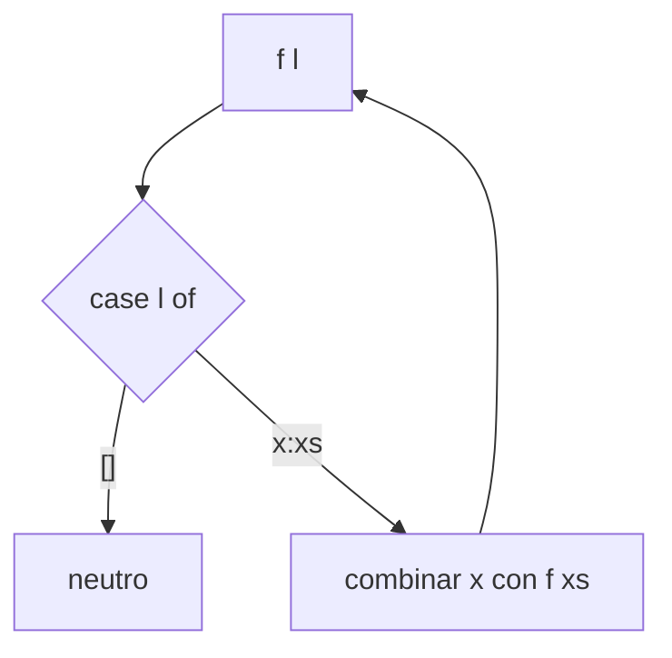

# Construcción de funciones recursivas sobre listas

## Objetivo

Entra una lista (y a veces una función); sale una función recursiva estructural: un caso por
constructor del `data`.

✅ [repaso-haskell p.2] "Recordemos el data de las listas visto en fundamentos:
`data [a] where {[] :: [a]; (:) :: a -> [a] -> [a]}`"

✅ [repaso-haskell p.2] "Ahora veremos el data de la siguiente forma:
`data [a] = [] | (:) a [a]`"

## Procedimiento

1. El `data` tiene **dos constructores**: `[]` y `(:)`. Entonces hay exactamente dos casos.
2. Caso `[]`: el resultado es el **neutro** de la operación que estés acumulando
   (`0` para sumar, `1` para multiplicar, `True` para `and`, `[]` para construir listas).
3. Caso `x:xs`: combiná `x` con el resultado de la llamada recursiva sobre `xs`. Nunca sobre
   `x:xs`, o no termina.
4. Forma λ: `f = λl -> case l of { [] -> <neutro>; x:xs -> <combinar x (f xs)>}`.
5. Forma pattern-matching: `f [] = <neutro>` y `f (x:xs) = <combinar>`.
6. 🧠 Si la función devuelve una lista (`map`, `filter`), el caso base es `[]`, no `0`.

## Diagrama



## Caso resuelto

✅ [repaso-haskell p.2] La cátedra resuelve `length` en las dos formas:

```haskell
length :: [a] -> Integer
length = λl -> case l of { [] -> 0; x:xs -> 1+(length xs)}

length :: [a] -> Integer
length [] = 0
length (x:xs) = 1+(length xs)
```

🧠 Aplicando el procedimiento a `map`, que el repartido deja como consigna:

```haskell
map :: (a -> b) -> [a] -> [b]
map = λf -> λl -> case l of { [] -> []; x:xs -> (f x):(map f xs)}

map :: (a -> b) -> [a] -> [b]
map f [] = []
map f (x:xs) = (f x):(map f xs)
```

Resolución **inferida**, no oficial.

## Consignas pendientes

✅ [repaso-haskell p.2] Firmas y ejemplos textuales del repartido:

| Ej. | Firma | Ejemplo de la cátedra |
|---|---|---|
| (b) | `map :: (a -> b) -> [a] -> [b]` | `map even [1,4,3,0] = [False, True, False, True]` |
| (c) | `filter :: (a -> Bool) -> [a] -> [a]` | `filter even [1,6,5,3,2] = [6,2]` |
| (d) | `zip :: [a] -> [b] -> [(a,b)]` | `zip [1,5,4,2] [True, True, False] = [(1,True), (5,True), (4,False)]` |

✅ [repaso-haskell p.2] Sección "Listas con tipos":

| Ej. | Firma | Ejemplo de la cátedra |
|---|---|---|
| (a) | `sum :: [Integer] -> Integer` | `sum [6,5,2] = 6 + 5 + 2 = 13` |
| (b) | `prod :: [Integer] -> Integer` | `prod [1,5,2,0] = 1 * 5 * 2 * 0 = 0` |
| (c) | `and :: [Bool] -> Bool` | `and [True, True, False] = True && True && False = False` |
| (d) | `or :: [Bool] -> Bool` | `or [True, True, True] = True \|\| True \|\| True = True` |

🧠 `zip` es la única que recursiona sobre **dos** listas a la vez: necesita tres casos, porque
se corta cuando **cualquiera** de las dos se vacía. El ejemplo de la cátedra lo muestra: entran
4 y 3 elementos, salen 3 pares.

🧠 Las cuatro de "Listas con tipos" son el mismo esqueleto cambiando neutro y operación:
`0`/`+`, `1`/`*`, `True`/`&&`, `False`/`||`.

## Relacionado

- [[comparativas/lambda-case-vs-pattern-matching]] — las dos formas, lado a lado
- [[construcciones/funciones-sobre-enteros]] — la misma recursión sobre `Integer`
- [[construcciones/funciones-sobre-arboles]] — el mismo esqueleto con dos llamadas recursivas
- [[fuentes/repaso-haskell]]
