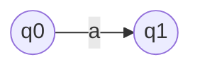
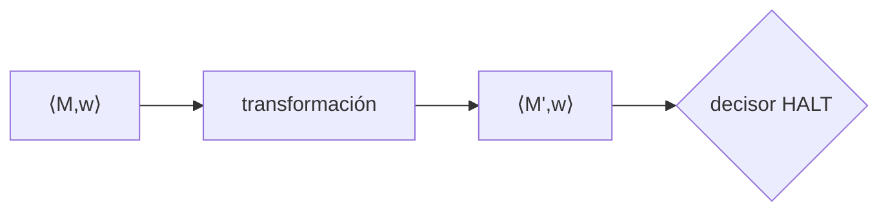
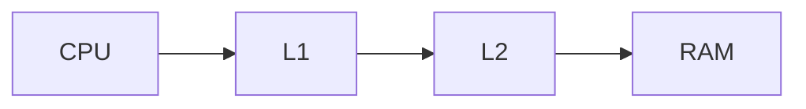
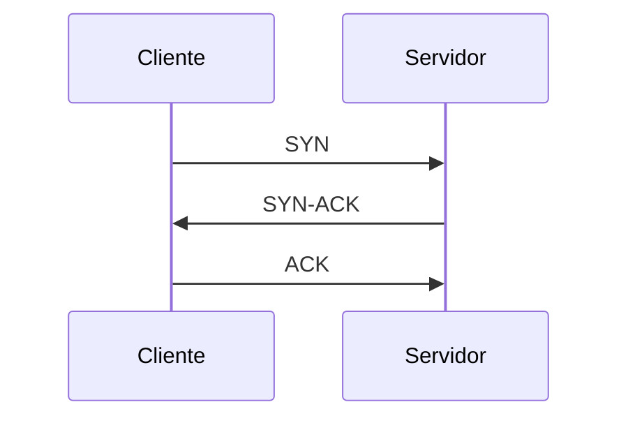

# Catálogo de tipos de página

15 tipos primitivos. Cada página del wiki es de uno de estos tipos: el `tipo` del
frontmatter define qué secciones son obligatorias y qué chequea `/lint`.

## Reglas del catálogo

1. **Máximo 8 tipos activos por materia.** Se eligen en `/nueva-materia` según la evidencia
   de evaluación y se declaran en el `CLAUDE.md` de la materia. Más de 8 tipos = ninguno se
   usa bien.
2. **Se pueden renombrar** al vocabulario de la cátedra (`construccion` → `maquinas`,
   `mecanismo` → `dispositivo`). El alias mantiene la **regla de verificación del tipo base**.
   Registrá el alias en el `CLAUDE.md` de la materia: `maquinas → construccion`.
3. **Un tipo nuevo se propone solo si**: (a) ningún primitivo encaja, (b) se esperan ≥3
   instancias en la materia, y (c) se escribe su regla de verificación. Los tres, o no va.
4. **Todo tipo hereda las marcas de fidelidad.** Contenido literal `✅ [fuente p.N]`,
   síntesis `🧠`, contradicción `⚠️`. Ningún tipo se las saltea.
5. **Tope de 150 líneas por página.** Si se pasa, partila y enlazá las partes.
6. La sección `## Relacionado` es obligatoria en todos los tipos: sin enlaces salientes la
   página queda huérfana y el wiki deja de ser wiki.

## Carpeta de cada tipo

El `id` es `materia/<carpeta>/<slug>` y la carpeta va en plural. Usá exactamente estas:

| Tipo | Carpeta |
|---|---|
| `definicion` | `definiciones/` |
| `teorema` | `teoremas/` |
| `demostracion` | `demostraciones/` |
| `construccion` | `construcciones/` |
| `reduccion` | `reducciones/` |
| `mecanismo` | `mecanismos/` |
| `protocolo` | `protocolos/` |
| `comparativa` | `comparativas/` |
| `ataque` | `ataques/` |
| `modelo` | `modelos/` |
| `practica` | `practicas/` |
| `framework` | `frameworks/` |
| `caso` | `casos/` |
| `debate` | `debates/` |
| `numeros` | `numeros/` |

## Elegir tipo

| Si la fuente presenta… | Tipo |
|---|---|
| un término con significado preciso | `definicion` |
| una afirmación que se demuestra | `teorema` |
| el argumento que prueba algo | `demostracion` |
| un procedimiento que produce un objeto | `construccion` |
| "el problema A se resuelve usando B" | `reduccion` |
| algo que funciona por dentro de cierta forma | `mecanismo` |
| un intercambio entre partes con reglas | `protocolo` |
| dos o más alternativas que compiten | `comparativa` |
| una forma de romper algo | `ataque` |
| una representación abstracta de la realidad | `modelo` |
| una recomendación de cómo hacer las cosas | `practica` |
| un conjunto de roles, artefactos y fases | `framework` |
| una situación concreta con una decisión | `caso` |
| una discusión abierta entre posturas | `debate` |
| cifras que hay que saber de memoria | `numeros` |

---

## `definicion`

**Cuándo**: un término con significado preciso, sobre el que se apoyan otras páginas.

**Campos obligatorios**: enunciado literal ✅ · notación · ejemplo · contraejemplo · confusiones frecuentes

**Regla de verificación** (`/lint`):
- `## Enunciado` tiene al menos una marca `✅ [fuente p.N]` y es transcripción, no paráfrasis.
- `## Ejemplo` y `## Contraejemplo` no están vacíos: una definición sin contraejemplo no se entendió.
- `## Confusiones frecuentes` nombra al menos otro concepto del wiki con `[[tipo/slug]]`.

````markdown
## Enunciado
✅ [sipser-cap1 p.31] Un lenguaje es *regular* si algún autómata finito lo reconoce.
## Notación
`L(M)` denota el lenguaje reconocido por la máquina M.
## Ejemplo
✅ [sipser-cap1 p.32] El conjunto de cadenas con cantidad par de ceros.
## Contraejemplo
🧠 `{aⁿbⁿ : n ≥ 0}` no lo es: exigiría memoria no acotada.
## Confusiones frecuentes
No confundir con [[definicion/lenguaje-libre-contexto]].
````

---

## `teorema`

**Cuándo**: una afirmación que la cátedra enuncia como resultado y usa para justificar otras cosas.

**Campos obligatorios**: enunciado literal ✅ · hipótesis explícitas · demostración (o `estado: sin-demo`) · cuándo se aplica · errores típicos de aplicación

**Regla de verificación** (`/lint`):
- `## Enunciado` es transcripción textual con `✅ [fuente p.N]`. Un teorema parafraseado es un teorema roto.
- `## Hipótesis` lista cada condición por separado. Si el enunciado dice "si … entonces", cada premisa va como ítem.
- Si `## Demostración` está vacía, el frontmatter debe decir `estado: sin-demo`; si no, `/lint` lo reporta.
- `## Errores típicos` no vacío: casi siempre es "aplicarlo sin verificar una hipótesis".

````markdown
## Enunciado
✅ [sipser-cap1 p.77] Si A es un lenguaje regular, existe p tal que toda s ∈ A con |s| ≥ p
puede escribirse s = xyz cumpliendo las tres condiciones del lema.
## Hipótesis
- A es regular ✅ [sipser-cap1 p.77]
- |s| ≥ p, con p el largo de bombeo
## Demostración
Ver [[demostracion/lema-bombeo]].
## Errores típicos
🧠 Usarlo para probar que un lenguaje **es** regular: solo sirve para probar que no lo es.
````

---

## `demostracion`

**Cuándo**: el argumento que prueba un teorema, cuando la cátedra lo toma o lo usa como modelo.

**Campos obligatorios**: qué prueba · técnica · pasos · dónde suele fallar el estudiante

**Regla de verificación** (`/lint`):
- `## Qué prueba` enlaza al `[[teorema/...]]` correspondiente. Una demostración huérfana no sirve.
- `## Técnica` es una de: inducción · contradicción · diagonalización · construcción · contrarrecíproco · conteo. Si es otra, se declara.
- `## Pasos` está numerado y cada paso que cita un resultado previo lo enlaza.

````markdown
## Qué prueba
[[teorema/lema-bombeo]].
## Técnica
Principio del palomar sobre los estados del AFD.
## Pasos
1. Sea M un AFD con p estados que reconoce A ✅ [sipser-cap1 p.78]
2. Al leer s con |s| ≥ p, algún estado se repite.
3. El tramo entre repeticiones se puede bombear.
## Dónde suele fallar el estudiante
🧠 Elegir la cadena s *después* de ver la partición; el adversario elige la partición.
````

---

## `construccion`

**Cuándo**: un procedimiento que produce un objeto (una máquina, un grafo, una gramática, un esquema).

**Campos obligatorios**: objetivo · procedimiento paso a paso · diagrama Mermaid · caso de prueba resuelto

**Regla de verificación** (`/lint`):
- `## Procedimiento` está numerado y es ejecutable a mano, sin decisiones ambiguas.
- Hay un bloque ```mermaid``` (o una figura extraída de la fuente en `assets/`).
- `## Caso resuelto` parte de una entrada concreta y llega a la salida. Sin ejemplo trabajado no se aprueba un parcial.

````markdown
## Objetivo
Dado un AFN, obtener un AFD equivalente.
## Procedimiento
1. Estado inicial: la clausura-ε del inicial del AFN ✅ [apunte-catedra p.9]
2. Para cada subconjunto alcanzable y cada símbolo, calcular el subconjunto destino.
3. Finales: los subconjuntos que contienen algún final del AFN.
## Diagrama

## Caso resuelto
Entrada: AFN de 3 estados → AFD de 4 estados alcanzables.
````

---

## `reduccion`

**Cuándo**: "el problema A se resuelve/decide usando B", o "si pudiera resolver A, resolvería B".

**Campos obligatorios**: de A a B · qué implica · esquema del argumento · diagrama

**Regla de verificación** (`/lint`):
- El título y `## De A a B` fijan la **dirección** sin ambigüedad. Una reducción al revés es un error que cuesta el ejercicio entero.
- `## Qué implica` dice explícitamente qué se concluye (indecidibilidad, dureza, cota) y qué **no**.
- Hay diagrama o esquema del flujo de la transformación.

````markdown
## De A a B
Se reduce A_MT a HALT_MT (A_MT ≤ₘ HALT_MT) ✅ [sipser-cap5 p.216]
## Qué implica
Si HALT_MT fuera decidible, A_MT lo sería. Como A_MT no lo es, HALT_MT tampoco.
🧠 No implica nada sobre la co-enumerabilidad de HALT_MT.
## Esquema
1. Dada ⟨M,w⟩, construir M' que simula M sobre w y cicla si M rechaza.
2. Preguntar a la hipotética decisora de HALT por ⟨M',w⟩.
## Diagrama

````

---

## `mecanismo`

**Cuándo**: algo que funciona internamente de cierta manera (caché, planificador, índice, pipeline).

**Campos obligatorios**: qué problema resuelve · cómo funciona por dentro · diagrama · costo/latencia

**Regla de verificación** (`/lint`):
- `## Qué problema resuelve` está en una oración y no repite el nombre del mecanismo.
- `## Costo` tiene números u órdenes de magnitud con fuente ✅, o dice explícitamente `sin dato en las fuentes`.
- Hay diagrama.

````markdown
## Qué problema resuelve
Evitar el acceso a memoria principal en cada lectura ✅ [patterson-cap5 p.383]
## Cómo funciona
Bloques indexados por dirección; ante fallo se trae la línea completa y se desaloja según política.
## Diagrama

## Costo
✅ [patterson-cap5 p.390] L1 ≈ 1-2 ciclos · RAM ≈ 100-300 ciclos.
````

---

## `protocolo`

**Cuándo**: un intercambio entre partes con reglas, orden y garantías.

**Campos obligatorios**: actores · secuencia (Mermaid `sequenceDiagram`) · garantías · supuestos · modos de falla

**Regla de verificación** (`/lint`):
- `## Actores` los enumera antes de la secuencia.
- Hay un bloque ```mermaid``` con `sequenceDiagram`.
- `## Supuestos` y `## Modos de falla` no vacíos: un protocolo sin supuestos declarados es propaganda.

````markdown
## Actores
Cliente, Servidor.
## Secuencia

## Garantías
✅ [tanenbaum-cap6 p.552] Entrega ordenada y sin duplicados sobre canal no confiable.
## Supuestos
El canal puede perder y reordenar, pero no corromper sin detección.
## Modos de falla
SYN flood: el estado a medio abrir se acumula 🧠.
````

---

## `comparativa`

**Cuándo**: dos o más alternativas que compiten por el mismo lugar.

**Campos obligatorios**: tabla obligatoria (nunca prosa) · criterio de decisión · cuándo elegir cada uno

**Regla de verificación** (`/lint`):
- **Contiene una tabla markdown.** Una comparativa en prosa se rechaza: no se puede estudiar ni recordar.
- La tabla tiene una fila por alternativa y una columna por criterio, con las mismas columnas para todas.
- `## Cuándo elegir cada uno` tiene una línea por alternativa, en imperativo.

````markdown
## Tabla
| | AFD | AFN |
|---|---|---|
| Transiciones | deterministas | conjunto de destinos |
| Tamaño | hasta 2ⁿ estados | n estados |
| Poder expresivo | igual ✅ [sipser-cap1 p.55] | igual |
## Criterio de decisión
Poder expresivo idéntico: se elige por tamaño y por comodidad de construcción.
## Cuándo elegir cada uno
- AFN: para **construir** (unión, concatenación, estrella).
- AFD: para **ejecutar** y para probar no-regularidad.
````

---

## `ataque`

**Cuándo**: una forma concreta de romper, evadir o abusar de algo.

**Campos obligatorios**: precondiciones · mecanismo · impacto · mitigación · detección

**Regla de verificación** (`/lint`):
- `## Precondiciones` dice qué necesita el atacante (acceso, posición, permisos). Sin esto el ataque parece magia.
- `## Mitigación` y `## Detección` son secciones distintas y ninguna está vacía.
- `## Impacto` clasifica qué propiedad se pierde: confidencialidad, integridad o disponibilidad.

````markdown
## Precondiciones
Ejecución de código sin privilegios en la misma máquina ✅ [paper-spectre p.2]
## Mecanismo
Se entrena el predictor de saltos y se leen los restos en la caché por canal lateral.
## Impacto
Confidencialidad: lectura de memoria de otro proceso.
## Mitigación
Barreras de especulación; aislamiento de tablas de páginas.
## Detección
Contadores de fallos de caché anómalos 🧠.
````

---

## `modelo`

**Cuándo**: una representación abstracta que la materia usa para razonar (OSI, MT, entidad-relación, cascada).

**Campos obligatorios**: qué modela · axiomas/reglas · limitaciones · críticas

**Regla de verificación** (`/lint`):
- `## Limitaciones` y `## Críticas` no vacías. Un modelo sin límites declarados se confunde con la realidad, y eso se cobra en el oral.
- `## Axiomas` enumera las reglas del modelo, no su historia.

````markdown
## Qué modela
La computación efectiva mediante una cinta infinita y un control finito ✅ [sipser-cap3 p.166]
## Axiomas
- Cinta infinita a la derecha, lectura/escritura de a un símbolo.
- Transición determinada por (estado, símbolo leído).
## Limitaciones
No modela costo real de memoria ni concurrencia.
## Críticas
🧠 Su valor es teórico: nadie programa una MT, pero fija qué es computable.
````

---

## `practica`

**Cuándo**: una recomendación sobre cómo hacer las cosas (revisión de código, integración continua, normalización).

**Campos obligatorios**: qué es · cuándo aplica · **cuándo NO aplica** · antipatrón asociado

**Regla de verificación** (`/lint`):
- `## Cuándo NO aplica` **no puede estar vacía**. Una práctica sin contexto de no-aplicación es dogma, y los orales preguntan exactamente ahí.
- `## Antipatrón` nombra la forma degradada concreta de la práctica.

````markdown
## Qué es
Integrar a la rama principal varias veces por día, con build automático ✅ [fowler-ci p.1]
## Cuándo aplica
Equipos con suite de pruebas rápida y dueño claro del build.
## Cuándo NO aplica
Sin pruebas automáticas: integrar seguido solo acelera la rotura 🧠.
## Antipatrón
"CI teatral": el pipeline corre pero nadie atiende el rojo.
````

---

## `framework`

**Cuándo**: un conjunto articulado de roles, artefactos y fases (Scrum, RUP, ITIL, COBIT).

**Campos obligatorios**: roles · artefactos · ceremonias/fases (tabla) · críticas

**Regla de verificación** (`/lint`):
- Las ceremonias o fases van **en tabla**, con propósito y frecuencia/duración.
- `## Roles` distingue responsabilidad de cada uno; no alcanza con listar nombres.
- `## Críticas` no vacía.

````markdown
## Roles
| Rol | Responsabilidad |
|---|---|
| Product Owner | prioriza el backlog ✅ [scrum-guide p.6] |
| Scrum Master | remueve impedimentos |
## Artefactos
Product Backlog · Sprint Backlog · Incremento.
## Ceremonias
| Ceremonia | Propósito | Frecuencia |
|---|---|---|
| Daily | sincronizar | diaria, 15 min |
## Críticas
🧠 Se adopta la ceremonia sin la autonomía del equipo: "Scrum de cascada".
````

---

## `caso`

**Cuándo**: una situación concreta donde alguien decidió algo (típico de finales orales y materias de proceso).

**Campos obligatorios**: situación · decisión · justificación · qué cambiaría si…

**Regla de verificación** (`/lint`):
- `## Qué cambiaría si…` tiene al menos dos variantes con su consecuencia. Es lo que convierte el caso en algo transferible.
- `## Justificación` enlaza a la `[[practica/...]]`, `[[modelo/...]]` o `[[teorema/...]]` que la sostiene.

````markdown
## Situación
Sistema de facturación con picos de fin de mes 10× el promedio ✅ [enunciado-parcial-2024 p.2]
## Decisión
Cola de mensajes y procesamiento asíncrono.
## Justificación
Desacopla la recepción del procesamiento; ver [[practica/backpressure]].
## Qué cambiaría si…
- El pico fuera constante → escalar horizontal en vez de encolar.
- Se exigiera respuesta inmediata → asincronía no sirve, hay que dimensionar para el pico.
````

---

## `debate`

**Cuándo**: la cátedra presenta posturas enfrentadas y espera que tomes posición (finales orales).

**Campos obligatorios**: postura A ✅ · postura B ✅ · dónde está el desacuerdo real · tu posición 🧠

**Regla de verificación** (`/lint`):
- Ambas posturas tienen cita ✅ de fuentes **distintas**. Si las dos salen de la misma fuente, no es debate: es una comparación.
- `## Desacuerdo real` identifica el supuesto que separa las posturas, no repite ambas.
- `## Tu posición` está marcada `🧠` y `/profesor` nunca evalúa sobre ella.

````markdown
## Postura A
✅ [mcconnell-cap3 p.44] La estimación temprana es posible con datos históricos.
## Postura B
✅ [demarco-cap2 p.18] La estimación temprana es ficción de gestión.
## Desacuerdo real
Si el proyecto es suficientemente parecido a los anteriores como para que la historia aplique.
## Tu posición
🧠 Con dominio conocido, A; con producto nuevo, B.
````

---

## `numeros`

**Cuándo**: cifras que hay que tener en la cabeza (latencias, cotas, límites, tamaños).

**Campos obligatorios**: valores a memorizar · orden de magnitud · fuente ✅

**Regla de verificación** (`/lint`):
- **Cada valor tiene su cita `✅ [fuente p.N]`.** Un número sin fuente es una alucinación con formato de dato.
- Los valores van en tabla, con unidad explícita.
- `## Orden de magnitud` da la regla mnemotécnica, no repite la tabla.

````markdown
## Valores
| Operación | Latencia | Fuente |
|---|---|---|
| Referencia a L1 | 1 ns | ✅ [dean-numbers p.1] |
| Lectura de SSD | 150 µs | ✅ [dean-numbers p.1] |
## Orden de magnitud
🧠 Cada salto de nivel es ×100: caché → RAM → SSD → disco → red intercontinental.
````
